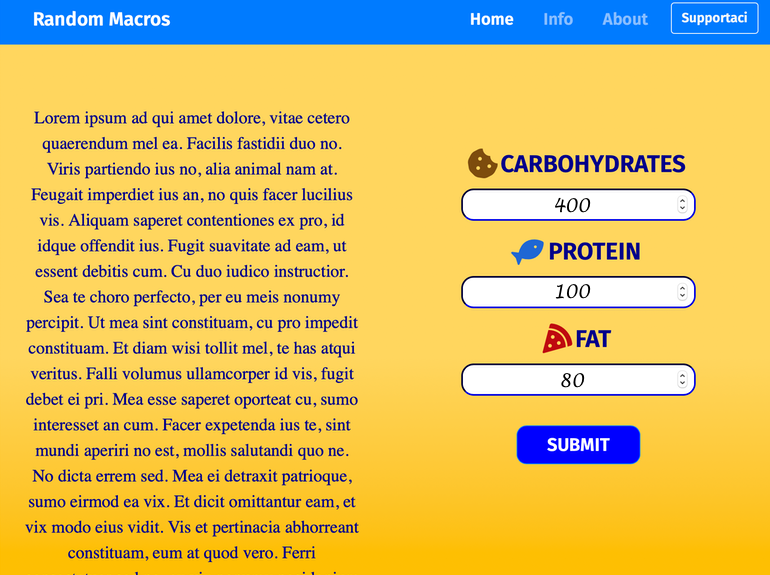

# Random Macros
## An app made with html5, css, vanilla javascript, nodejs, express and mongodb
### Put your macros inside and it gives you a random diet!

- The frontend is made with html5, css and javascript
- The backend is made in nodejs, express
- The database is in mongoDB
- The website is not onlone, so the backend and the database works only locally

